# KAP: Kayak Adapted Paddle

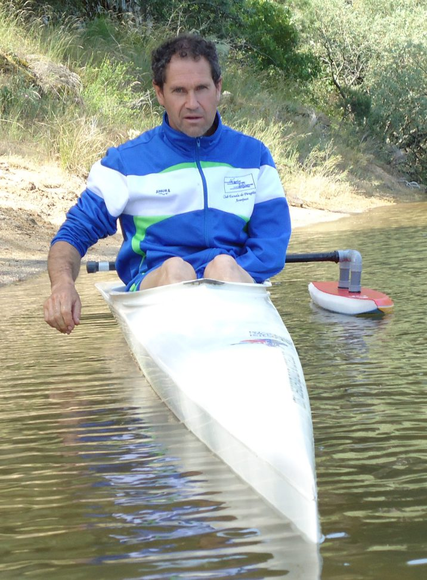

KAP, son las siglas que definen al sistema de propulsión para kayaks individuales o múltiples, aplicado a personas con deficiencia/as o carencia/as, total o parcial de una extremidad superior, con un grado tal, que les impediría en circunstancias normales, realizar la función de manejar una pala de kayak con ambos brazos a la vez, para la práctica del piragüismo.

***La creación de este dispositivo KAP, responde a la necesidad de facilitar el acceso a la práctica del piragüismo a estas personas.***

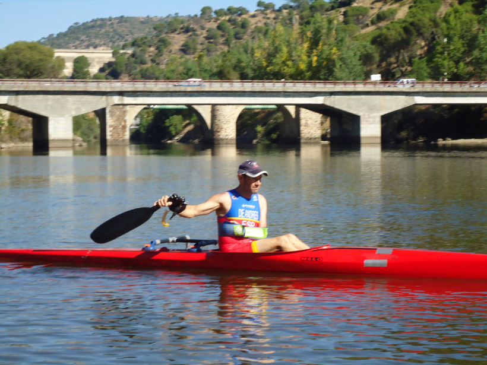

## Definición

Se define **KAP** como el dispositivo capaz de permitir la práctica de piragüismo en su modalidad de kayak, a personas con un sólo miembro superior funcional, por medio de una pala adaptada para su utilización con el miembro hábil.

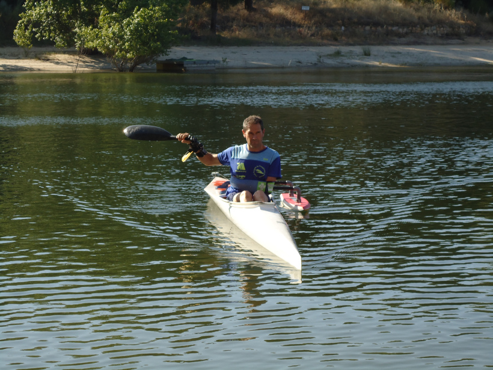

El **KAP** ha sido diseñado sobre el formato de los kayaks que actualmente se utilizan en competición en regatas y campeonatos en aguas tranquilas y descensos, desarrollándose a partir de  los parámetros vigentes en el apartado de medidas y pesos que reglamenta la FIC.

Este punto de  partida, garantiza su eficacia y comodidad de uso también en otras embarcaciones más estables, lo que facilita su uso para cualquier persona sin necesidad de estar iniciado en piragüismo.

El **KAP**, está formado por dos elementos: una estructura rígida o **anclaje** que se fija al antebrazo del deportista y una **pala adaptada** a dicho elemento.

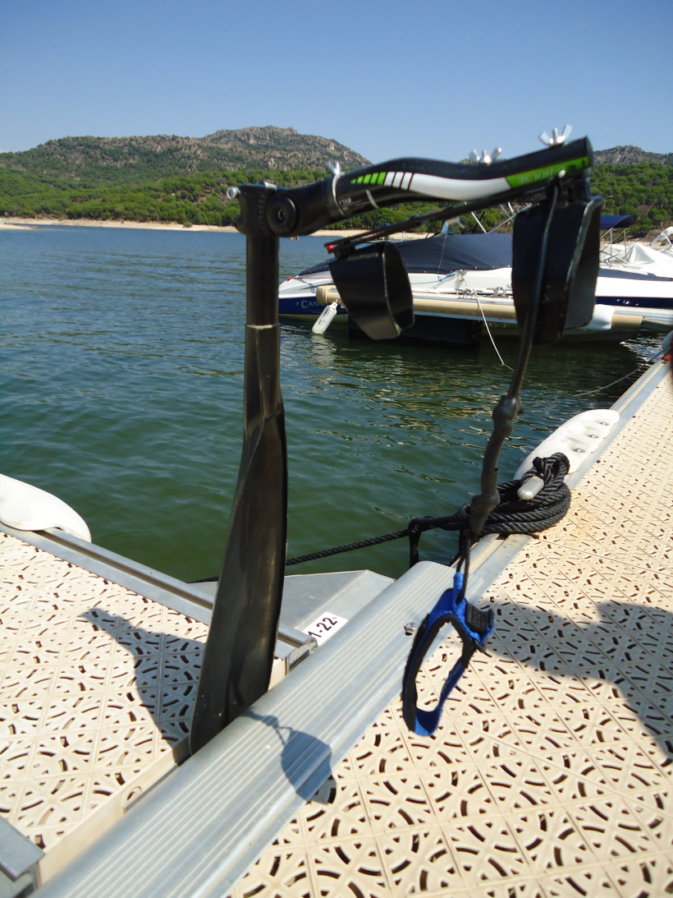

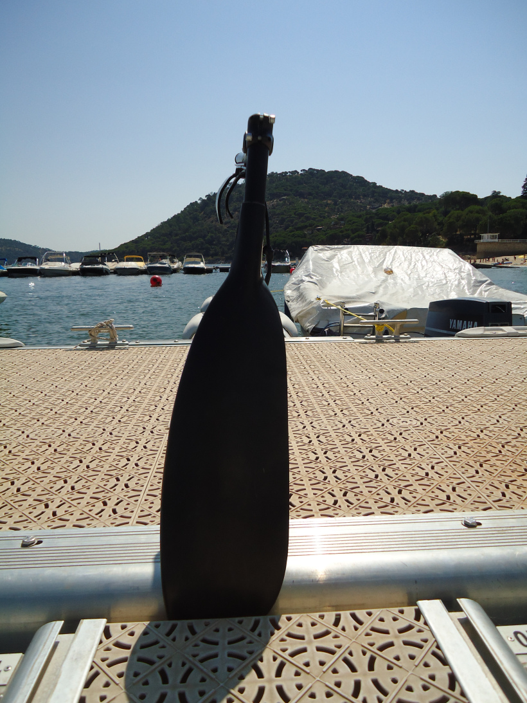

Otro elemento fundamental para el desarrollo del paleo en estas circunstancias, aunque no forma parte del **KAP**, es el **torpedo** estabilizador.

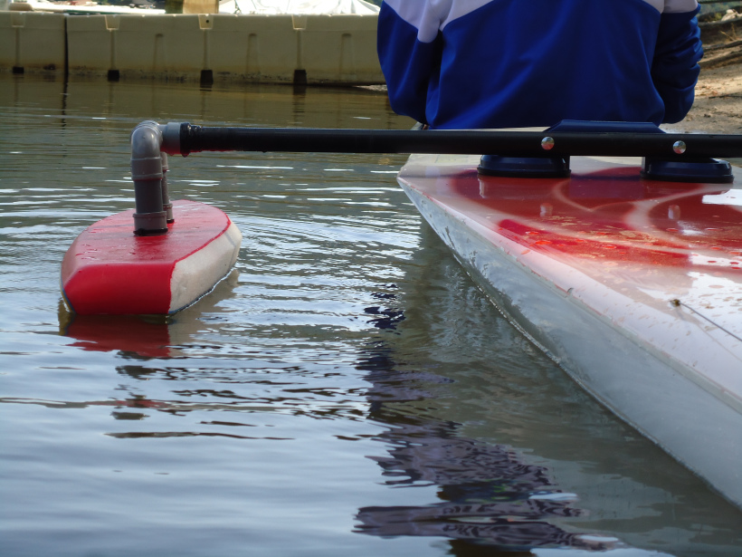

El **torpedo,** tal y como más adelante se detalla, es un accesorio al **KAP **que se convierte en un elemento indispensable en determinadas situaciones para garantizar la estabilidad sobre el lado opuesto al paleo durante la fase aérea o recobro.

Como norma común, la utilización del **torpedo** junto con el **KAP**, queda generalizada siempre que el paleo se realice sobre kayaks individuales de competición para aguas tranquilas o descensos deportivos, dada la dificultad que este tipo de embarcaciones conllevan por su inestabilidad.

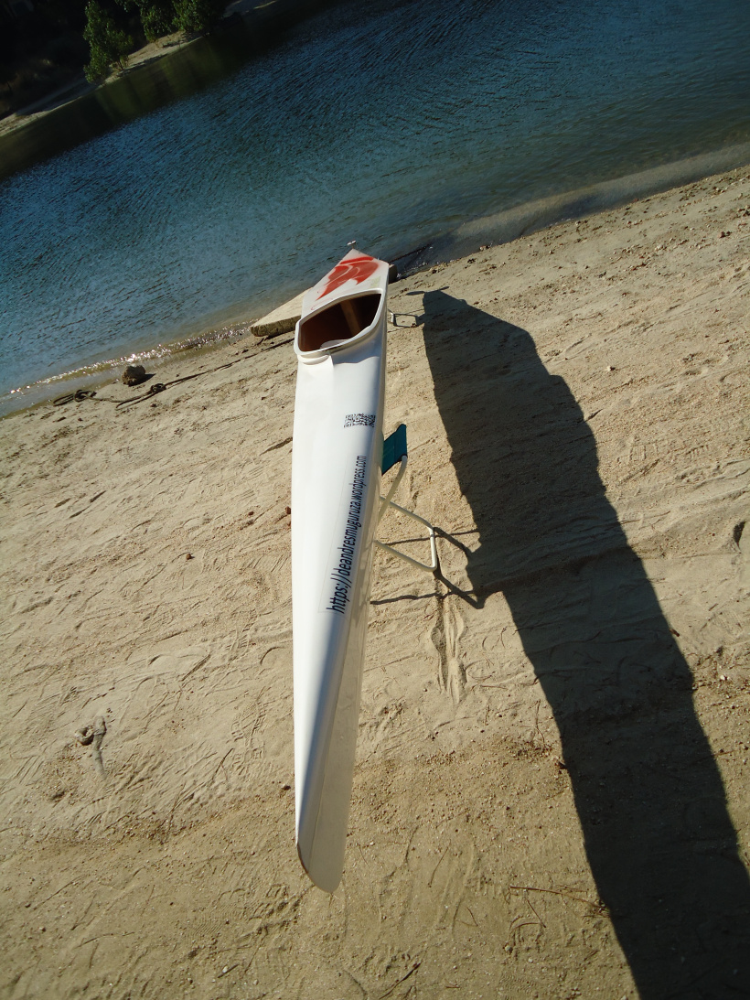

Ante la gran variedad de kayaks disponibles en el mercado y sus características de navegación y estabilidad, deberá ser el propio deportista el que deba considerar la utilización del **torpedo** o no, bajo su responsabilidad.

En situaciones donde la estabilidad queda asegurada, bien por tratarse de embarcaciones múltiples ( k-2 o k-4 ), bien por el tipo de construcción o diseño del kayak, o bien por la propia destreza del palista, resulta factible utilizar sólo la pala adaptada **KAP** sin necesidad de instalar el **torpedo **o estabilizador.

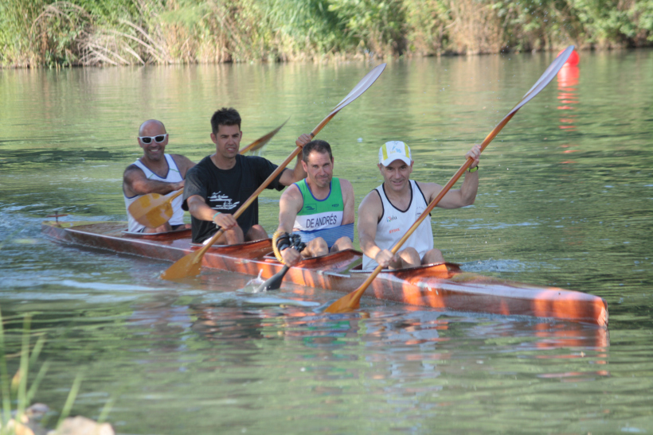

Cabe reseñar, la necesidad de utilizar un  kayak **CON TIMÓN** al palear con el **KAP** , ya que al realizar la propulsión sólo por una banda de
la embarcación, resulta difícil e incómodo, mantener la dirección deseada.

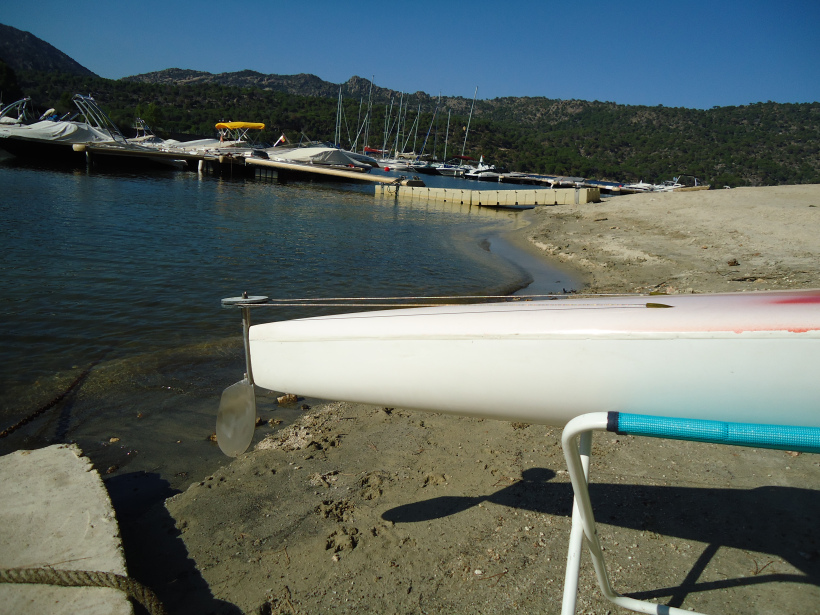

## Pala Adaptada

Constituye en sí, la base y eje fundamental para poder remar en kayak **sin** la aportación de la fuerza y estabilidad que proporciona el otro brazo, al poder suplir gracias a este diseño, el par de fuerzas que se genera en el paleo convencional con dos brazos.

### La Cuchara

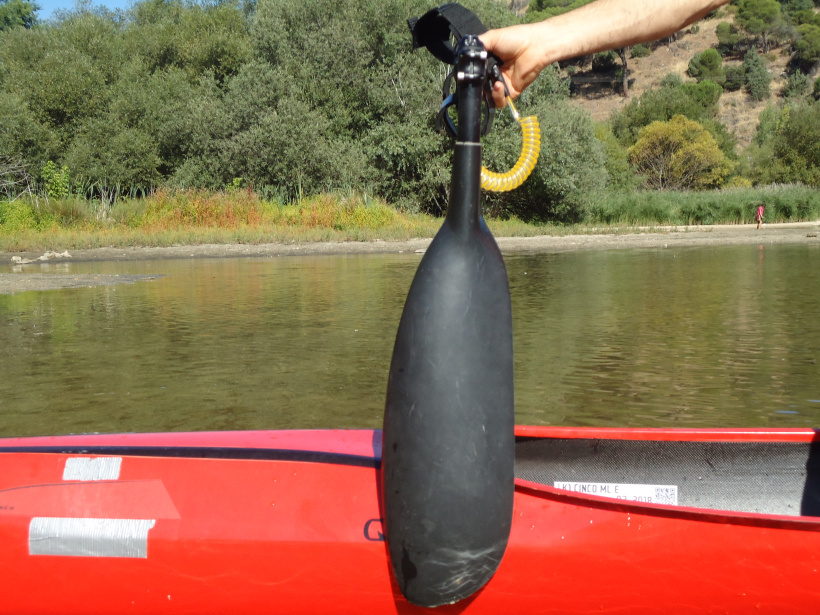

Es la pieza que está en contacto con el agua en el momento de la propulsión.

La elección de una cuchara con mayor o menor superficie de contacto con el agua, va a determinar el grado de apoyo hidrodinámico y por tanto la de velocidad de desplazamiento. Lógicamente cuanto mayor sea la cuchara mayor deberá ser la condición física y destreza del palista para su manejo.

En piragüismo, las cucharas de las palas son específicas para el lado derecho o izquierdo, por lo que es necesario reseñar, que la cuchara a adaptar al **KAP** debe de ser la correspondiente al miembro hábil (derecha o izquierda).

Las posibilidades que aporta el **KAP** para adaptar diferentes modelos de cuchara es bastante amplia, aunque la conclusión final respecto a la efectividad en el desplazamiento y las reacciones frente al gobierno del kayak, es  que  las cucharas actuales "modelo" Rasmussen, son muy superiores a las cucharas planas.

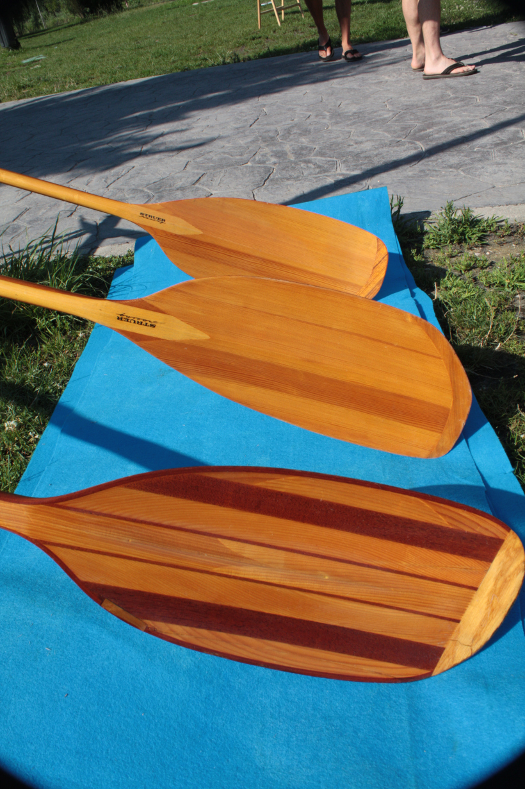

Referido a las dimensiones  del área de superficie de contacto con el agua, se recomiendan hojas de cuchara pequeñas como las que se utilizan  en periodos  de iniciación al inicio del aprendizaje.

***Al día de hoy, existe un amplio abanico de constructores y modelos dónde poder escoger la hoja más adecuada a las características de fuerza y envergadura de cada palista***.

### Anclaje

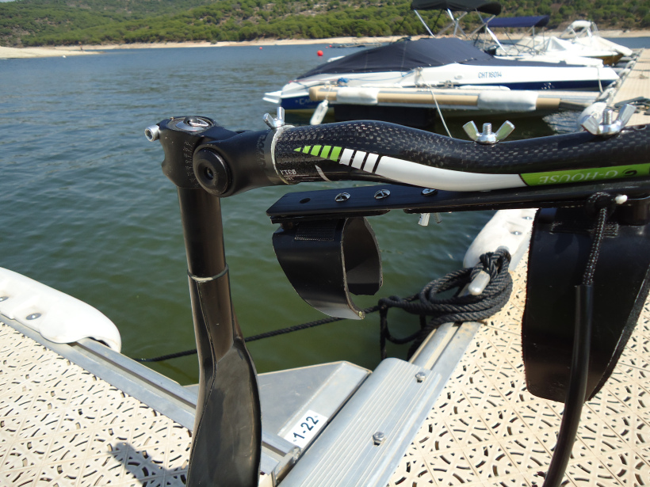

Constituye la pieza de transmisión, que permite utilizar la fuerza aplicada al agua en su punto de apoyo por medio de la cuchara, para generar desplazamiento a la embarcación.

Su función fundamental es transmitir con la mayor eficacia, la fuerza aplicada, así como recibir sensaciones sobre la superficie del agua para gobernar la embarcación con seguridad y sin producir desgaste o lesión en las articulaciones de la muñeca y codo.

El anclaje termina su función antes del codo, para así dejar libertad de movimientos en la articulación de codo y hombro, permitiendo ejecutar correctamente la técnica del paleo.

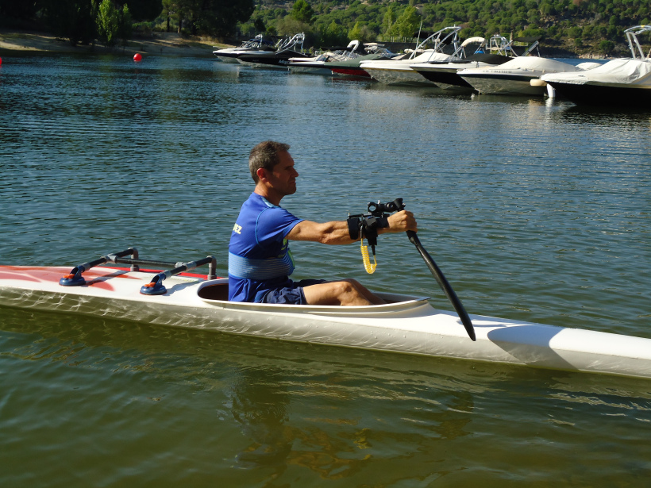

Existen varias posibilidades en el ángulo de ataque gracias a que incorpora un sistema que varía dicho ángulo en función de  las necesidades y grado de exigencia del kayakista.

### Torpedo o estabilizador

Es el accesorio que se fija a la cubierta del kayak para proporcionar estabilidad a la embarcación durante la fase aérea de la palada.

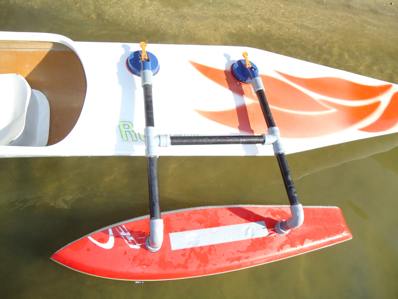

Se sitúa por medio de un anclaje sobre la cubierta de la embarcación, justo por detrás de la bañera, para generar un apoyo extra necesario durante el lapso de tiempo en que el palista permanece en equilibrio **sin** contacto con el agua y realizando el movimiento de recobro con el tronco y brazo para volver a armar el punto de ataque de la siguiente palada.

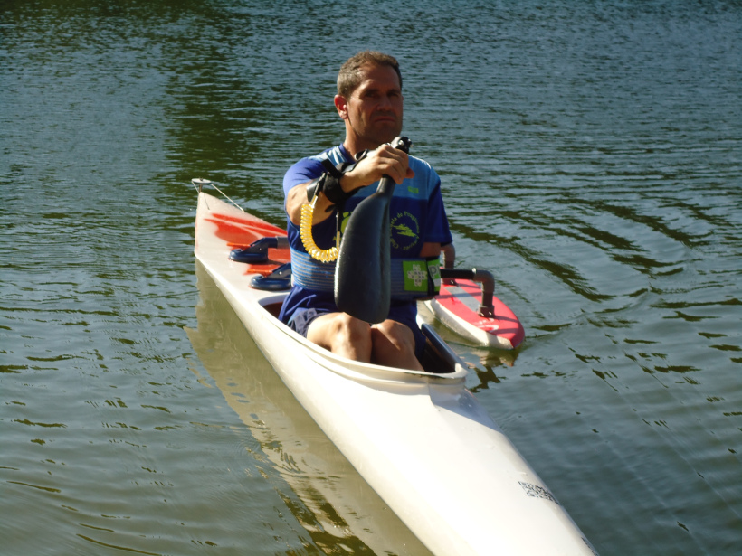

Está construido con material que proporciona alta flotabilidad y estabilidad.

Tal y como ya se ha descrito, resulta imprescindible cuando se palea con kayaks individuales  de competición en aguas tranquilas.

Si se utilizan kayaks que sean  más estables (tipo travesía, turismo o iniciación) y dependiendo del grado de destreza sobre la embarcación del deportista, se puede suprimir su utilización. Así mismo no se considera su uso en embarcaciones de equipo Kayak- 2 Y Kayak-4.

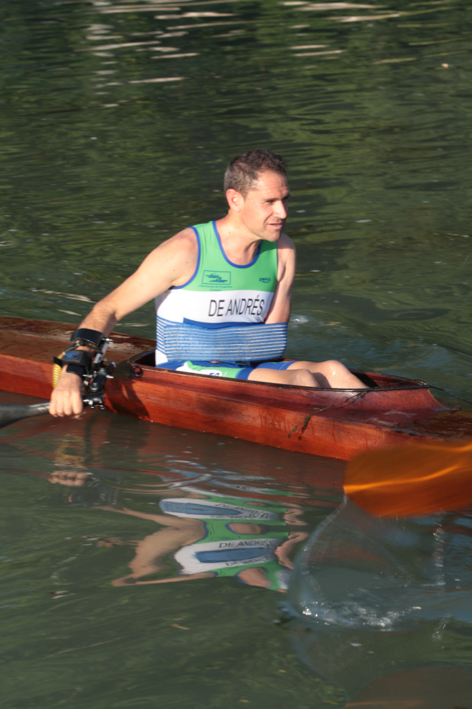